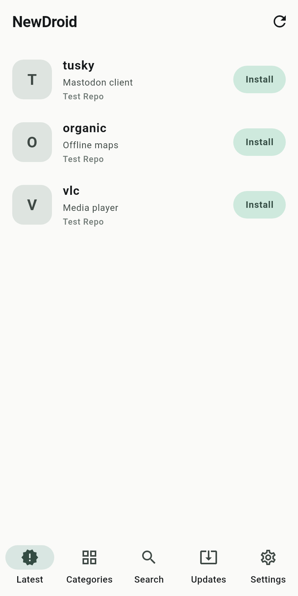
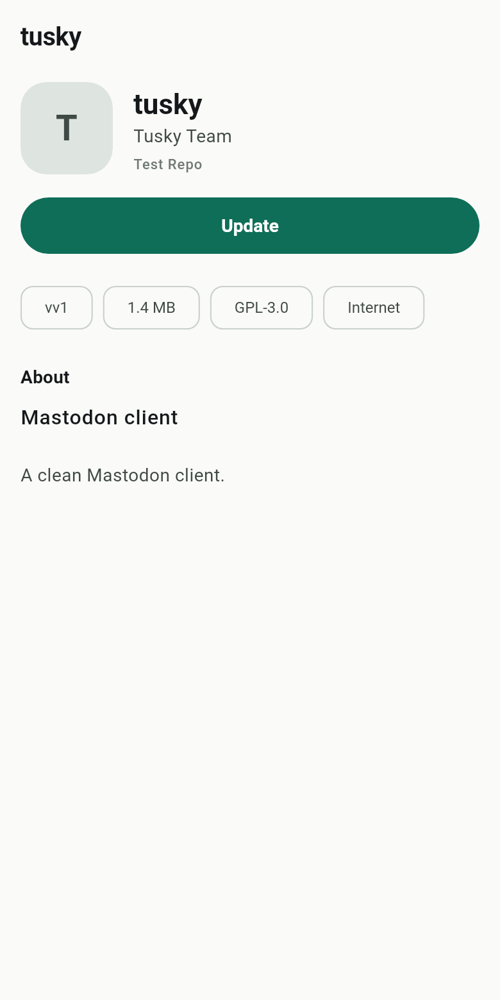
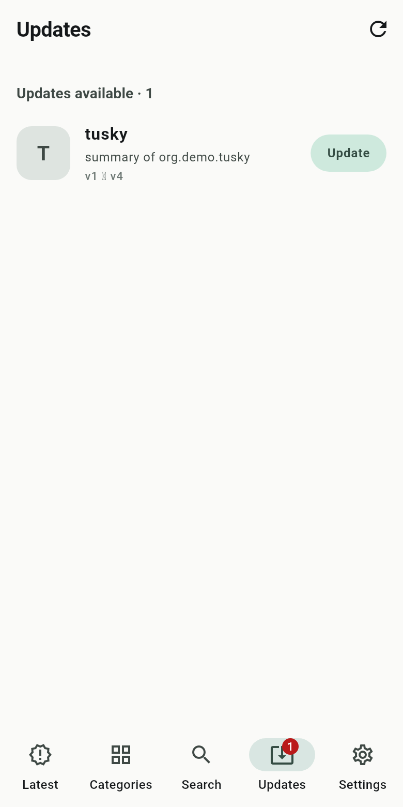

# NewDroid

[](https://gitlab.com/HttpAnimations/newdroid/-/pipelines)
[](https://gitlab.com/HttpAnimations/newdroid/-/releases)
[](LICENSE)

A fast, modern F-Droid client for Android. Browse, search, install and update
free-software Android apps from F-Droid-compatible repositories.

<p>
  
  
  
</p>

## Features

- Browse the F-Droid catalog sorted by last update, or by category
- Fast search across name, package and description
- App details with screenshots, changelogs, permissions and version history
- One-tap installs and updates, with SHA-256 verification of every APK
- Update detection against your installed apps (signature-aware)
- Multiple repositories: F-Droid, IzzyOnDroid and Guardian Project presets,
  plus any custom index-v2 or index-v1 repo URL
- Incremental index refresh (ETag conditional requests) so updates stay cheap
- Light and dark themes, Material 3

## Install

Download the latest signed APK from
[the releases page](https://gitlab.com/HttpAnimations/newdroid/-/releases)
and open it on your device.

Website and landing page:
[httpanimations.gitlab.io/newdroid](https://httpanimations.gitlab.io/newdroid/)

## Development

```bash
flutter pub get
flutter test
flutter run
```

Releases are automated: conventional commits on `main` are bumped by
[cocogitto](https://github.com/cocogitto/cocogitto), built on GitHub Actions
and mirrored back to GitLab releases so binaries never expire.

## License

[GNU AGPL v3](LICENSE)
